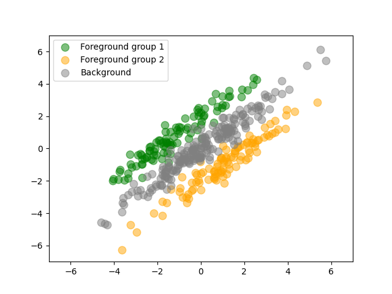

# Probabilistic contrastive principal component analysis

This repo contains models and algorithms for probabilistic contrastive principal component analysis (PCPCA). Given a foreground dataset and a backround dataset, PCPCA is designed to find structure and variation that is enriched in the foreground relative to the background.


The accompanying paper can be found here: https://arxiv.org/abs/2012.07977.

## Installation

After cloning this repo, navigate to its directory, and run the following command.
```
python setup.py install
```

You should then be able to import the model as follows:
```python
from pcpca import PCPCA
```
## Example

Here's a simple example of fitting PCPCA with a toy dataset. In this data, the foreground contains two subgroups.

Load the toy dataset and plot it:
```python
import pandas as pd
import matplotlib.pyplot as plt

# Load
X = pd.read_csv("./data/toy/foreground.csv", header=None).values
Y = pd.read_csv("./data/toy/background.csv", header=None).values

# Should have same number of features
assert X.shape[0] == Y.shape[0]

p, n = X.shape
m = Y.shape[1]

# Plot
plt.scatter(X[0, :n//2], X[1, :n//2], alpha=0.5, label="Foreground group 1", s=80, color="green")
plt.scatter(X[0, n//2:], X[1, n//2:], alpha=0.5, label="Foreground group 2", s=80, color="orange")
plt.scatter(Y[0, :], Y[1, :], alpha=0.5, label="Background", s=80, color="gray")
plt.legend()
plt.xlim([-7, 7])
plt.ylim([-7, 7])
plt.show()
```



Now we'll instantiate and fit the model with maximum likelihood estimation.

```python
from pcpca import PCPCA
pcpca = PCPCA(gamma=0.7, n_components=1)
pcpca.fit(X, Y)
```

We can then visualize the line defined by W. (In general, this will be a hyperplane, but here we set n_components=1 for simplicity.)

```python
import numpy as np
def abline(slope, intercept):
    """Plot a line from slope and intercept"""
    axes = plt.gca()
    x_vals = np.array(axes.get_xlim())
    y_vals = intercept + slope * x_vals
    plt.plot(x_vals, y_vals, '--')

# Re-plot data
plt.scatter(X[0, :n//2], X[1, :n//2], alpha=0.5, label="Foreground group 1", s=80, color="green")
plt.scatter(X[0, n//2:], X[1, n//2:], alpha=0.5, label="Foreground group 2", s=80, color="orange")
plt.scatter(Y[0, :], Y[1, :], alpha=0.5, label="Background", s=80, color="gray")
plt.legend()
plt.xlim([-7, 7])
plt.ylim([-7, 7])

# Plot line defined by W
origin = np.array([[0], [0]])  # origin point
abline(slope=pcpca.W_mle[1, 0] / pcpca.W_mle[0, 0], intercept=0)
plt.show()
```

We can see that W finds the axis that splits the two foreground groups:


Once the model is fit, samples can be projected onto the components by calling `transform`:

```python
X_reduced, Y_reduced = pcpca.transform(X, Y)
```

Or both of these steps can be done with one call to `fit_transform`:

```python
X_reduced, Y_reduced = pcpca.fit_transform(X, Y)
```
